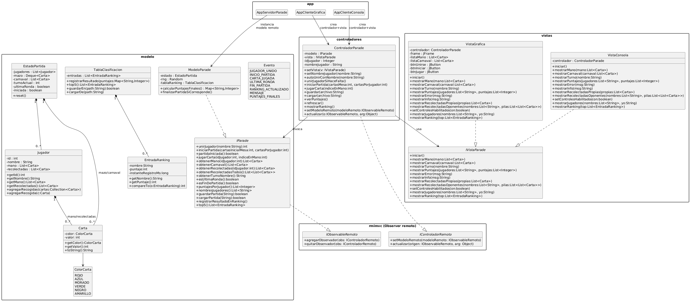

ParadeRMI  
Alumno: Justino Bernal
Legajo: 190118

🃏 ¿Qué es Parade?

Parade es un juego de cartas donde los jugadores intentan terminar con la menor cantidad de puntos posible.
Hay 66 cartas (6 colores × valores 0 a 10).
En el centro se forma una fila llamada carnaval, y cada jugador tiene una mano de cartas.

🖥 Arquitectura general del proyecto

Este proyecto implementa el juego usando:

MVC distribuido

RMI para comunicación cliente-servidor

Observer remoto para actualizar las vistas en tiempo real

Dos clientes: Vista gráfica (Swing) y Vista consola

El servidor mantiene todo el estado del juego (mazo, jugadores, carnaval, puntajes).
Los clientes solo muestran la información y envían acciones.

🚪 1. Unión de jugadores y preparación

Antes de jugar:

Los clientes se conectan al servidor.

Cada jugador se une indicando un nombre.

El servidor prepara la partida:

Mezcla el mazo

Reparte las cartas

Coloca cartas iniciales en el carnaval

Define quién empieza

No hay jugadas todavía; es solo configuración inicial.

🔁 2. Turnos y jugadas

La partida avanza por turnos.
En cada turno, un jugador:

Elige una carta de su mano

La juega al final del carnaval

El servidor aplica las reglas de Parade:

Reglas al jugar una carta:

Si prev ≤ valor, no se retira nada

Si prev > valor, se evalúan las primeras prev - valor cartas

Se retiran las que:

tienen el mismo color que la jugada, o

tienen valor menor o igual

Las cartas retiradas van a la pila de “recolectadas” del jugador.

Luego:

Si no es última ronda → el jugador roba una carta del mazo

El turno pasa al siguiente

El modelo envía un evento para actualizar todas las vistas

🔔 3. Última ronda y fin de partida

Se activa cuando:

Un jugador recolectó los 6 colores, o

Se vació el mazo

Ahí ya no se roba más cartas.

La partida termina cuando:

Última ronda está activa, y

Todos los jugadores tienen exactamente 4 cartas en la mano

El servidor:

Calcula puntajes finales

Actualiza el ranking

Notifica a todos los clientes

🎯 Objetivo del juego

Ganar = tener menos puntos.

Los puntos se calculan así:

Suma de todos los valores de las cartas recolectadas

Bonificación por mayorías de color

En 2 jugadores, la mayoría vale solo si hay diferencia de 2 o más

🧩 Implementación (en 15 segundos)

Modelo:
Tiene las reglas, estado completo del juego y ranking.

Controlador:
Está en el cliente.
Traduce acciones (jugar, iniciar, unirse) a llamadas RMI.
Recibe eventos del servidor.

Vistas:
Gráfica (Swing) y consola.
Se actualizan con lo que el controlador les envía.

Observer remoto:
Cuando el servidor cambia algo,
todos los clientes se actualizan automáticamente.

📐 Diagrama UML  

- Las clases principales del modelo del juego (ModeloParade, EstadoPartida, Jugador, Carta, TablaClasificacion, EntradaRanking).  
- La interfaz remota IParade, utilizada por los clientes para comunicarse con el servidor.  
- El controlador (ControladorParade), que implementa la interfaz de controlador remoto y actúa como puente entre las vistas y el modelo.  
- Las vistas (VistaGrafica y VistaConsola), que implementan una interfaz común IVistaParade.

A continuación se muestra la imagen del UML:

